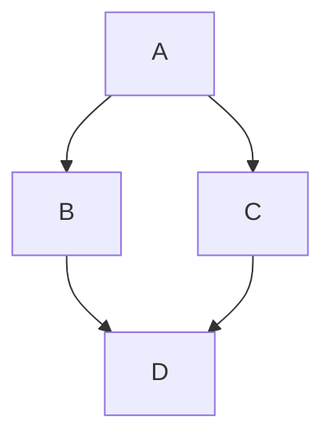

# github-demo

## Level 2 Heading

### Level 3 Heading

#### Level 4 Heading

##### Level 5 Heading

###### Level 6 Heading

No more headings here! 

Now you get bullets!!
    
- Bullet 1
- Bullet 2
- Bullet 3
- Bullet 4
  - Sub bullet 4.1
  - Sub bullet 4.2
    - Sub Sub bullet 4.2.1
    - Sub Sub bullet 4.2.2

## Annotations

> [!NOTE]
> Useful information that users should know, even when skimming content.

> [!TIP]
> Helpful advice for doing things better or more easily.

> [!IMPORTANT]
> Key information users need to know to achieve their goal.

> [!WARNING]
> Urgent info that needs immediate user attention to avoid problems.

> [!CAUTION]
> Advises about risks or negative outcomes of certain actions.


## Mermaid Diagrams


## Mermaid Info

```mermaid
  info
```


## geoJSON

```geojson
{
  "type": "FeatureCollection",
  "features": [
    {
      "type": "Feature",
      "id": 1,
      "properties": {
        "ID": 0
      },
      "geometry": {
        "type": "Polygon",
        "coordinates": [
          [
              [-90,35],
              [-90,30],
              [-85,30],
              [-85,35],
              [-90,35]
          ]
        ]
      }
    }
  ]
}
```
## Mathematical Notation
**The Cauchy-Schwarz Inequality**\
$$\left( \sum_{k=1}^n a_k b_k \right)^2 \leq \left( \sum_{k=1}^n a_k^2 \right) \left( \sum_{k=1}^n b_k^2 \right)$$


**The Cauchy-Schwarz Inequality**

```math
\left( \sum_{k=1}^n a_k b_k \right)^2 \leq \left( \sum_{k=1}^n a_k^2 \right) \left( \sum_{k=1}^n b_k^2 \right)
```


## Images


## Java Code

```java
import org.apache.log4j.LogManager;
import org.apache.log4j.Logger;
import sailpoint.object.Application;
import sailpoint.object.Field;
import sailpoint.object.Identity;
import sailpoint.server.IdnRuleUtil;

public class UsernameGenerator {
    Logger log = LogManager.getLogger(UsernameGenerator.class);
    Identity identity = new Identity();
    Application application = new Application();
    IdnRuleUtil idn;
    Field field = new Field();
}

```


