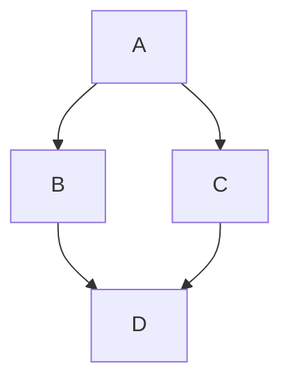

# github-demo

## Level 2 Heading

### Level 3 Heading

#### Level 4 Heading

##### Level 5 Heading

###### Level 6 Heading

No more headings here! 

Now you get bullets!!
    
- Bullet 1
- Bullet 2
- Bullet 3
- Bullet 4
  - Sub bullet 4.1
  - Sub bullet 4.2
    - Sub Sub bullet 4.2.1
    - Sub Sub bullet 4.2.2





```mermaid
  info
```

```geojson
{
  "type": "FeatureCollection",
  "features": [
    {
      "type": "Feature",
      "id": 1,
      "properties": {
        "ID": 0
      },
      "geometry": {
        "type": "Polygon",
        "coordinates": [
          [
              [-90,35],
              [-90,30],
              [-85,30],
              [-85,35],
              [-90,35]
          ]
        ]
      }
    }
  ]
}
```
